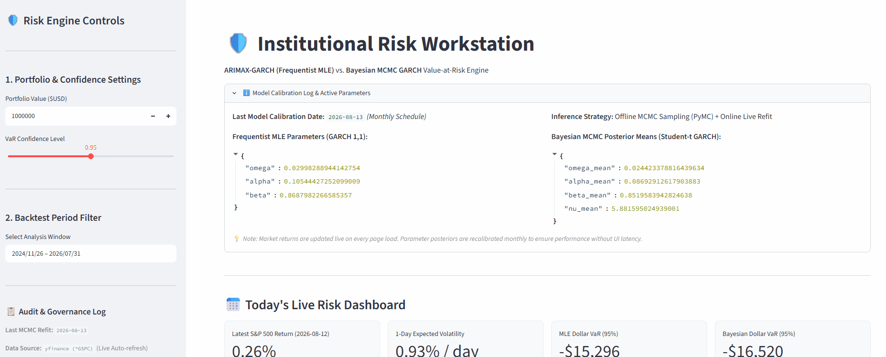
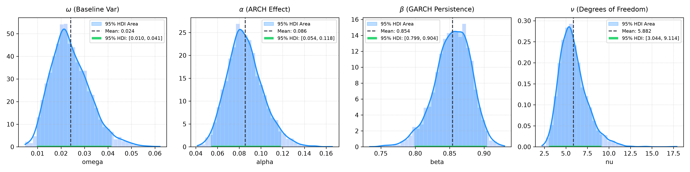
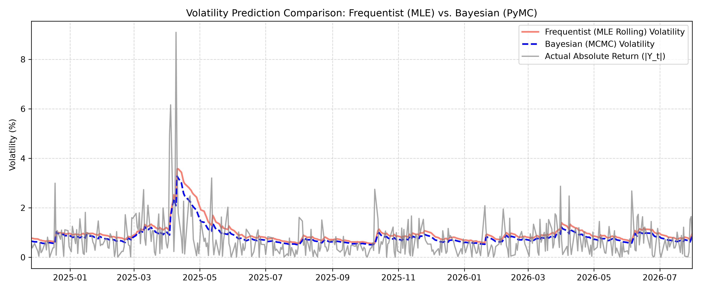
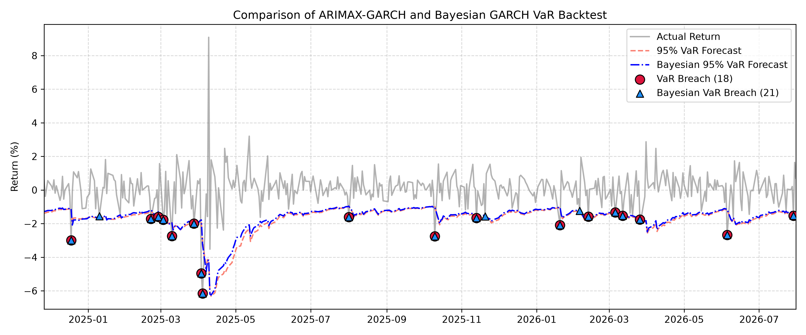
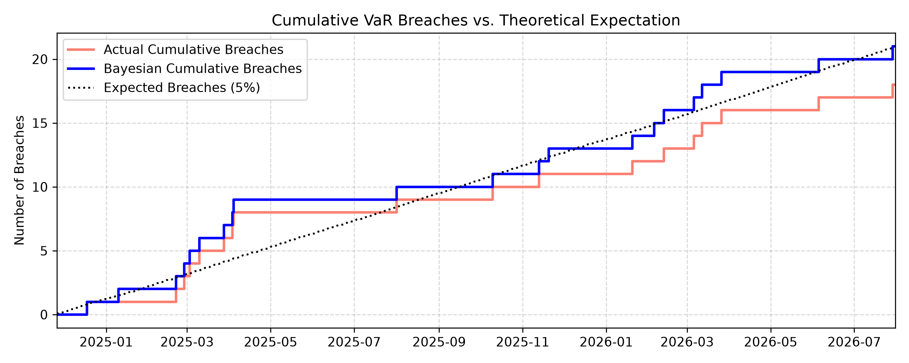

# Bayesian GARCH vs. ARIMAX-GARCH: Institutional VaR Engine

## Overview
A quantitative risk framework comparing **Frequentist ARIMAX-GARCH(1,1)** and **Bayesian $\text{Student-}t$ GARCH(1,1)** on S&P 500 data (2020–2026). It evaluates volatility clustering, fat-tailed risks, and parameter uncertainty to power an interactive **Streamlit Risk Workstation**.


> For in-depth details on Exploratory Data Analysis (EDA), Model Selection and Tuning, and Results, please refer to the [Full Technical Report](SP500_VaR_forecast_report.md).

---

## Demo



**Try the Live Interactive Web App:** [Institutional Risk Workstation on Streamlit Cloud](https://sp500-var-predictor-kmkfnps8tcyczabuq9jziv.streamlit.app)

---

## Key Features

* **ARIMAX Conditional Mean Modeling:** Captures underlying mean-reversion, ARMA autocorrelation structure, and exogenous macroeconomic predictors prior to variance modeling.
* **Bayesian MCMC Inference (PyMC):** Employs the No-U-Turn Sampler (NUTS) to construct full joint posterior distributions ($\omega, \alpha, \beta, \nu$), quantifying parameter uncertainty rather than relying on point-estimate MLE.
* **$\text{Student-}t$ Fat-Tail Integration:** Replaces standard Gaussian assumptions with a flexible $\text{Student-}t$ error distribution ($\nu \approx 5.88$) to accurately reflect real-world leptokurtosis and extreme tail risks.
* **Interactive Streamlit Workstation:** Ingests live market feeds (`yfinance`) for real-time 1-day Dollar VaR estimation, interactive backtest visualization, and scenario stress testing.

---

## Key Results

### 1. Bayesian Parameter Posteriors
<p align="center">
  
</p>

* **High Persistence:** $\beta$ mean of $0.852$ (95% HDI $[0.800, 0.900]$) confirms strong volatility clustering.
* **Fat Tails:** $\nu$ mean of $5.882$ (95% HDI $[3.291, 9.228]$) proves significant leptokurtosis over normal assumptions.

### 2. Volatility Prediction Comparison
<p align="center">
  
</p>

* Both models dynamically track returns during market spikes (e.g., April–May 2025).
* Bayesian volatility (blue) provides smoother adaptation against extreme single-day outliers.


### 3. Out-of-Sample VaR Backtest
<p align="center">
  
</p>

* At 95% confidence, **Frequentist MLE** yielded 18 breaches, while **Bayesian MCMC** recorded 21 breaches.
* Bayesian VaR incorporates parameter uncertainty to offer a more prudent risk floor.


### 4. Cumulative Breaches vs. Expectation
<p align="center">
  
</p>

* **Bayesian Cumulative Breaches** (21 breaches, blue) closely align with the theoretical 5% failure line (black dotted).
* Demonstrates superior calibration compared to MLE under structural volatility shifts.

---

## Tech Stack

* **Language:** Python `3.12.11`
* **Data Processing & Analysis:** yfinance, Pandas, NumPy
* **Machine Learning & Analysis:** arch, scipy, pymc, pytensor, arviz
* **Visualization:** Matplotlib, Seaborn, statsmodels
* **Web Framework:** Streamlit, plotly

---

## Project Structure

```text
SP500-VaR-predictor/
├── assets/
│   └── demo.gif                  # Demonstration GIF for README
├── SP500_VaR_forecast.ipynb      # Complete Machine Learning pipeline
├── SP500_VaR_forecast_report.md  # Comprehensive technical report
├── app.py                        # Interactive Streamlit web application
├── requirements.txt              # Python dependencies
└── README.md                     # Project documentation
```

The execution pipeline automatically generates and manages the following runtime directories:

```text
├── models/                 # Stores trained model results
└── plots/                  # Generated visualizations
    ├── EDA/                # Exploratory Data Analysis plots
    ├── arimax_garch/       # Evaluation of the ARIMAX-GARCH model
    └── bayesian_garch/     # Evaluation of the Bayesian-GARCH model
```

---

## How to Run

First clone the repository:
```bash
git clone https://github.com/BevisWong76/SP500-VaR-predictor.git
cd SP500-VaR-predictor
```

You can then set up the project locally using either the standard Python `venv` or the ultra-fast `uv` package manager.

### Option 1: Using Standard Python `venv` (Traditional)

1. Create a virtual environment:
```bash
python -m venv .venv
```

2. Activate the virtual environment:
```bash
# Windows (Command Prompt):
.venv\Scripts\activate.bat

# Windows (PowerShell):
.venv\Scripts\Activate.ps1

# macOS / Linux:
source .venv/bin/activate
```

3. Install dependencies:
```bash
pip install --upgrade pip
pip install -r requirements.txt
```

### Option 2: Using `uv` (Recommended for Speed)

`uv` is an extremely fast Python package installer and resolver written in Rust.

1. Install `uv` (if you haven't already):
```bash
pip install uv
```

2.  Create a virtual environment:

```bash
uv venv
```

3. Activate the virtual environment:
```bash
# Windows (Command Prompt):
.venv\Scripts\activate.bat

# Windows (PowerShell):
.venv\Scripts\Activate.ps1

# macOS / Linux:
source .venv/bin/activate
```

 4. Install dependencies:
```bash
uv pip install -r requirements.txt
```

### Run the Streamlit App

Once the dependencies are installed and the model artifacts are generated, launch the interactive web application:

```bash
streamlit run app.py
```

