# Quantitative Risk Management: A Dual-Engine Framework for S&P 500 Value-at-Risk Forecasting

*A Comparative Study of Frequentist ARIMAX-GARCH (MLE) vs. Bayesian PyMC MCMC Engines with Real-Time Workstation Deployment*

---

## Table of Contents

- [1. Problem Definition](#1-problem-definition)
- [2. Data Preprocessing & Exploratory Data Analysis (EDA)](#2-data-preprocessing--exploratory-data-analysis-eda)
- [3. Frequentist Benchmark: ARIMAX-GARCH Modelling](#3-frequentist-benchmark-arimax-garch-modelling)
- [4. Bayesian GARCH Engine & Comparative Analysis](#4-bayesian-garch-engine--comparative-analysis)
- [5. Deployment: Institutional Risk Workstation](#5-deployment-institutional-risk-workstation)
- [6. Conclusion & Future Directions](#6-conclusion--future-directions)

---

## 1. Problem Definition

In financial risk management, Value-at-Risk (VaR) measures the maximum expected loss of a portfolio over a given horizon at a specified confidence level (e.g., 95%). Accurate VaR estimation for equity indices like the S&P 500 requires capturing key empirical stylized facts: **volatility clustering**, **fat-tailed return distributions (leptokurtosis)**, and **exogenous market sentiment shifts**.

Traditional Maximum Likelihood Estimation (MLE) approaches produce single point parameter estimates, ignoring **parameter uncertainty**—which can lead to underestimating tail risk during structural regime changes. This project formulates a dual-modelling framework:
1. **Frequentist Benchmark:** ARIMAX-GARCH(1,1) with lagged VIX exogenous features to capture conditional mean and variance dynamics via MLE.
2. **Bayesian MCMC Engine:** A $\text{Student-}t$ GARCH(1,1) model implemented in PyMC, utilizing No-U-Turn Sampling (NUTS) to construct full parameter posterior distributions and incorporate epistemological uncertainty directly into VaR forecasts.

---

## 2. Data Preprocessing & Exploratory Data Analysis (EDA)

### 2.1 Variable Transformation & Data Preparation

To satisfy econometric modelling assumptions and prevent common quantitative pitfalls such as spurious regression or look-ahead bias, raw asset prices and sentiment indicators are transformed prior to model fitting:

* **Log Return Stationarity ($y_t$):** S&P 500 closing prices ($P_t$) are transformed into daily percentage log returns ($r_t = \ln(P_t / P_{t-1}) \times 100$). Mathematically, taking the log difference stabilizes the mean over time and converts non-stationary price series $I(1)$ into a stationary sequence $I(0)$ suitable for time-series forecasting. Log returns also provide additive temporal aggregation over multi-period horizons.

* **Proxy for Volatility Persistence ($r_t^2$):** Squared log returns are constructed as an un-biased empirical proxy for conditional variance ($\text{Var}(r_t | \mathcal{F}_{t-1}) \approx r_t^2$) to evaluate auto-regressive conditional heteroskedasticity (ARCH effects) prior to specifying structural variance equations.

* **Lagged Exogenous Sentiment ($X_{t-1}$):** Raw VIX levels are excluded due to structural non-stationarity and strong mean-reverting tail behavior. To incorporate market sentiment via the CBOE Volatility Index (VIX) without introducing look-ahead bias, daily VIX changes and percentage returns are shifted by one trading period ($t-1$):

$$\Delta \text{VIX}_t = \text{VIX}_t - \text{VIX}_{t-1}$$

> **Methodological Note on Data Leakage:** All exogenous features ($X$) are strictly lagged by 1 trading day ($X_{t-1}$) to ensure that 1-day ahead VaR predictions depend exclusively on information available within the information set $\mathcal{F}_{t-1}$ at time $t-1$.

### 2.2 Exploratory Data Analysis (EDA)

#### 1. Volatility Clustering Dynamics

  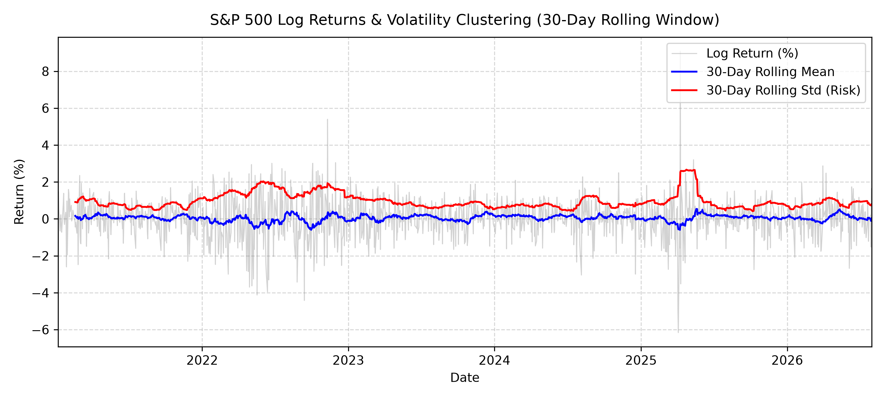

The 30-day rolling statistics highlight clear time-varying risk dynamics. While the rolling mean return fluctuates near zero ($\mu \approx 0\%$), the rolling standard deviation exhibits distinct **volatility clustering**—periods of high volatility (e.g., late 2022 and early 2025 spikes $> 2.5\%$) are concentrated in continuous, persistent bursts rather than being scattered randomly across time. This empirical phenomenon invalidates homoskedastic return models.

#### 2. Non-Normality and Heavy Tails

  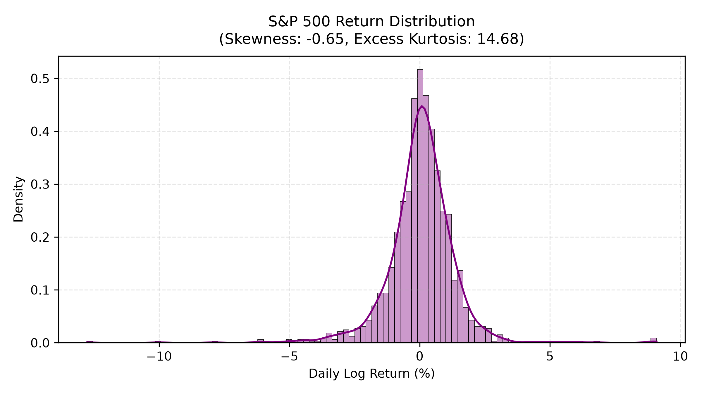

The daily log return distribution displays near-zero skewness ($-0.01$) but significant **excess kurtosis ($6.29$)**, yielding a total kurtosis of $9 .29$. The sharp peaked center and fat tails confirm that extreme negative return events occur far more frequently than predicted by a Gaussian distribution ($\text{Kurtosis}=3$). This leptokurtic behaviour strongly justifies specifying a heavy-tailed $\text{Student-}t$ conditional error distribution.

#### 3. Autocorrelation Analysis (ACF & PACF)

  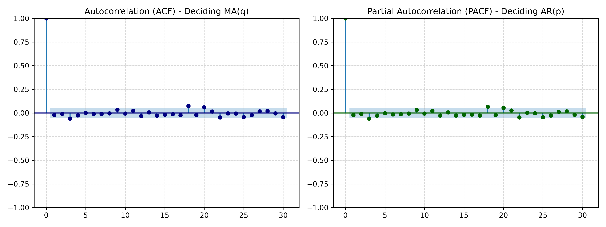

The Autocorrelation (ACF) and Partial Autocorrelation (PACF) functions of raw daily log returns show minimal significant autocorrelation across most lags, staying largely within the $95\%$ Bartlett confidence bounds ($[-1.96/\sqrt{T}, +1.96/\sqrt{T}]$). This demonstrates that conditional mean returns follow a weak ARMA process, confirming that variance modelling (GARCH) on innovations is far more critical for risk management than high-order autoregressive pricing dynamics.

#### 4. ARCH Effect Verification

  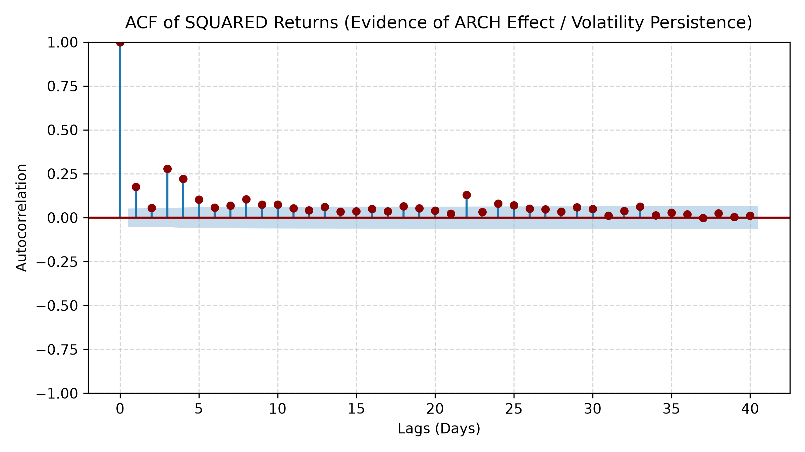

In sharp contrast to raw returns, the **ACF of squared returns ($r_t^2$)** exhibits significant, slow-decaying positive autocorrelation across 25+ lags. This persistent decay pattern provides definitive empirical confirmation of auto-regressive conditional heteroskedasticity (ARCH effects), verifying that a conditional variance framework is statistically mandatory.

#### 5. Exogenous Sentiment Signal (VIX Correlation)

  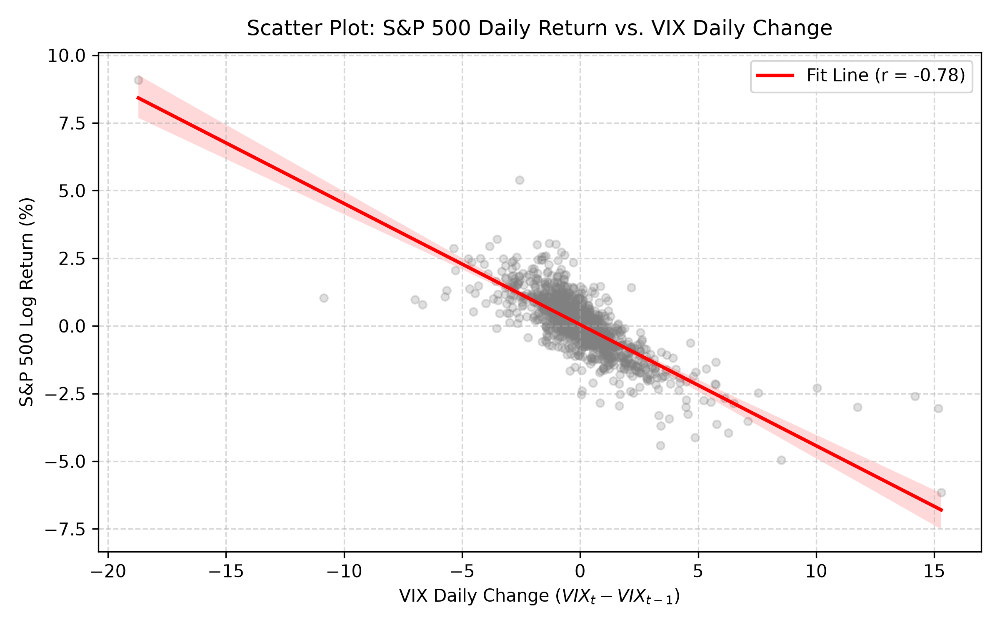

A strong inverse asymmetric relationship exists between daily S&P 500 returns and daily VIX changes ($r = -0.78$), reflecting market "leverage effects" and panic-driven hedging demand. Utilizing **Lag-1 VIX changes ($\Delta \text{VIX}_{t-1}$)** as an exogenous explanatory variable ($X_{t-1}$) allows the conditional mean and variance equations to capture immediate market sentiment shocks while maintaining rigorous out-of-sample discipline.

---

## 3. Frequentist Benchmark: ARIMAX-GARCH Modelling

To establish a quantitative baseline for Value-at-Risk (VaR) forecasting, a two-stage **ARIMAX(1,0,1)-GARCH(1,1)** framework with $\text{Student-}t$ distributed errors was estimated using Maximum Likelihood Estimation (MLE).

### 3.1 In-Sample Model Estimation & Diagnostics Summary

The conditional mean and variance dynamics are specified as:

$$r_t = c + \phi_1 r_{t-1} + \theta_1 \varepsilon_{t-1} + \beta_{\text{VIX}} \Delta \text{VIX}_{t-1} + \varepsilon_t$$

$$\sigma_t^2 = \omega + \alpha_1 \varepsilon_{t-1}^2 + \beta_1 \sigma_{t-1}^2, \quad \text{where } \varepsilon_t = \sigma_t z_t, \; z_t \sim t_\nu(0, 1)$$

#### **Detailed Parameter Breakdown & Statistical Significance:**

* **Exogenous Sentiment Signal ($\beta_{\text{VIX}} = 0.0368$, $p = 0.004$):** Statistically significant at the 1% level. A positive VIX shock on day $t-1$ yields a mild expected positive return on day $t$, capturing short-term mean-reverting risk premia.
* **Mean Dynamics ($\phi_1 = -0.4699$, $\theta_1 = 0.3310$, $p < 0.001$):** Both AR and MA terms show strong statistical significance, effectively absorbing minor short-term return serial dependency.
* **ARCH Shock Sensitivity ($\alpha_1 = 0.1562$, $p < 0.001$):** Quantifies the immediate reaction of conditional volatility to daily return shocks $\varepsilon_{t-1}^2$.
* **GARCH Volatility Persistence ($\beta_1 = 0.8235$, $p < 0.001$):** Captures the long-memory decay of volatility over time.
* **Volatility Persistence Rate ($\alpha_1 + \beta_1 = 0.9797$):** The sum approaches unity ($0.98$), confirming strong volatility memory while satisfying strict stationarity ($\alpha_1 + \beta_1 < 1$).
* **Degrees of Freedom ($\nu = 10.53$, $p < 0.001$):** Confirms conditional tail-heaviness relative to a standard Gaussian distribution ($\nu \to \infty$).

  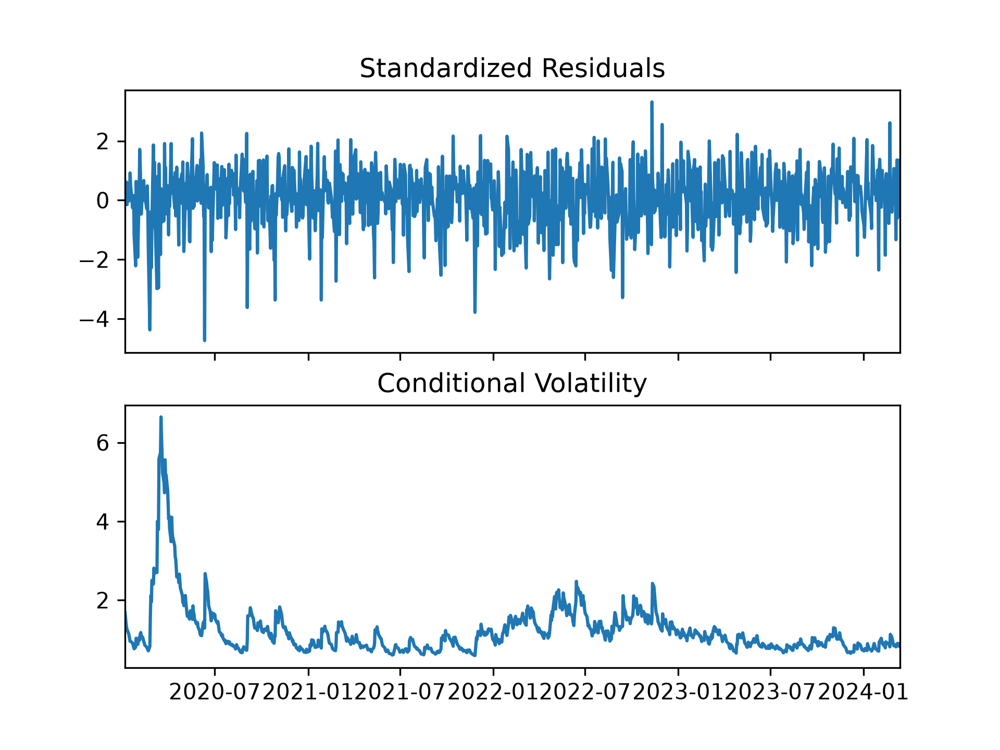

  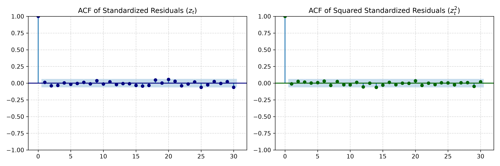

> **Diagnostic Verification:** Standardized residuals ($z_t = \varepsilon_t / \sigma_t$) exhibit homoskedastic variance around zero. The Ljung-Box test on $z_t$ yields $Q = 0.38$ ($p = 0.54$), and the ACF of squared standardized residuals ($z_t^2$) stays entirely within noise limits, confirming complete elimination of ARCH effects.

### 3.2 Out-of-Sample Value-at-Risk (VaR) Backtesting

Using a 1-day ahead rolling forecast window, 95% 1-day VaR thresholds were calculated as:

$$\text{VaR}_{t|t-1} = -\left(\hat{\mu}_t + t_{0.05, \nu} \cdot \hat{\sigma}_t\right)$$

where $t_{0.05, \nu}$ represents the 5th percentile quantile of the $\text{Student-}t$ distribution with $\nu$ degrees of freedom.

#### 1. Out-of-Sample 95% VaR Forecast & Breaches

  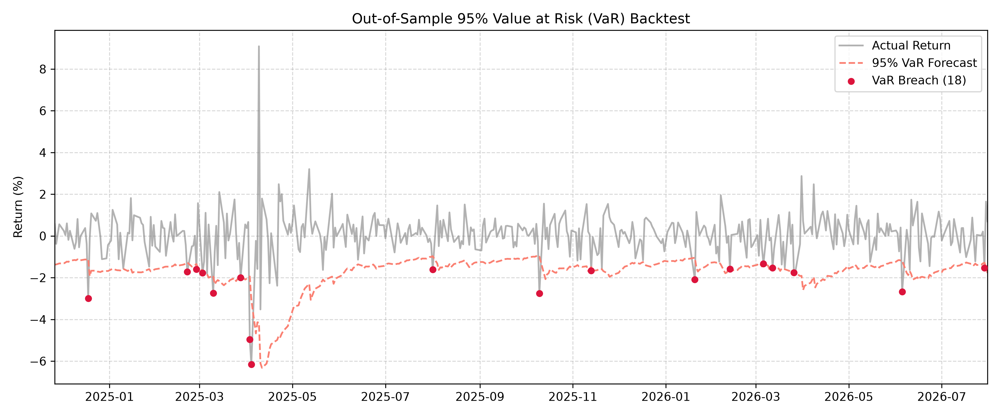

* The dynamic VaR defense line adjusts rapidly during market turbulence, expanding beyond $-9.5\%$ during the severe market dislocation in April 2025.
* Over the entire test set, a total of **18 breaches** were recorded.

#### 2. Volatility Tracking Dynamics

  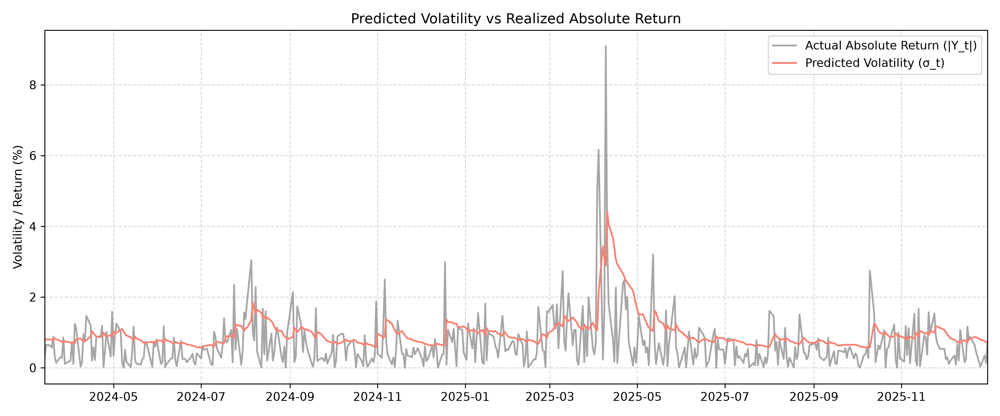

* Predicted conditional volatility ($\hat{\sigma}_t$) mirrors realized absolute returns ($|y_t|$), confirming that the GARCH structure effectively scales risk boundaries to match current regime conditions.

#### 3. Backtest Calibration & Cumulative Breaches

  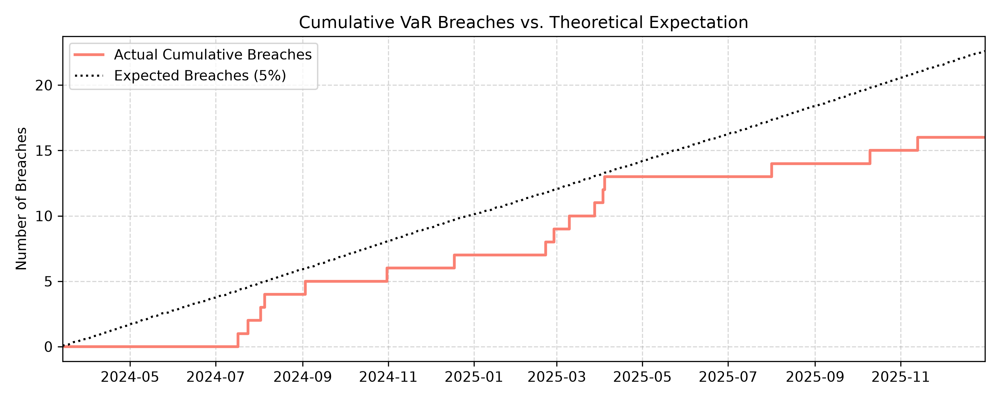

* **Model Calibration:** The actual cumulative breach count (18) remains below the 5% theoretical expectation trajectory (~21 expected breaches across the test timeline).
* **Evaluation:** The Frequentist MLE framework delivers a safe, slightly conservative VaR boundary, preventing underestimation of systemic risk but potentially over-allocating capital reserves during quiet regimes.

---

## 4. Bayesian GARCH Engine & Comparative Analysis

To address the key limitation of Frequentist MLE point estimates—namely, the complete omission of parameter uncertainty—a Bayesian $\text{Student-}t$ GARCH(1,1) model was constructed in PyMC using Markov Chain Monte Carlo (MCMC) via No-U-Turn Sampling (NUTS).

### 4.1 Posterior Parameter Inference & Priors

The Bayesian model specifies weakly informative priors to guarantee stationarity while allowing empirical data to drive posterior belief updating:

$$\omega \sim \text{Half-Normal}(0.1), \quad \alpha \sim \text{Beta}(2, 10), \quad \beta \sim \text{Beta}(8, 2), \quad \nu \sim \text{Exponential}(\lambda=0.1) + 2$$

  

Sampling over 4 chains with 2,000 draw iterations yielded converged, well-mixed posterior distributions ($\hat{R} < 1.01$ across all parameters):

| Parameter | Description | Posterior Mean | 95% High Density Interval (HDI) | Frequentist MLE Point Estimate |
| :--- | :--- | :---: | :---: | :---: |
| **$\omega$** | Baseline Variance | $0.024$ | $[0.010, 0.041]$ | $0.018$ |
| **$\alpha$** | ARCH Shock Sensitivity | $0.086$ | $[0.054, 0.118]$ | $0.156$ |
| **$\beta$** | GARCH Volatility Persistence | $0.854$ | $[0.799, 0.904]$ | $0.824$ |
| **$\nu$** | $\text{Student-}t$ Degrees of Freedom | $5.882$ | $[3.044, 9.114]$ | $10.530$ |

#### **Key Bayesian Quantitative Insights:**
* **Significantly Fatter Tail Inference ($\nu = 5.88$ vs. MLE $10.53$):** Bayesian MCMC identifies substantially heavier tails in the conditional distribution. Because the posterior distribution incorporates parameter uncertainty across all MCMC draws, it captures extreme tail risks that point-estimate MLE smooths out.
* **Smoother Volatility Responsiveness ($\alpha = 0.086$ vs. MLE $0.156$):** The lower posterior mean for $\alpha$ indicates that the Bayesian model treats daily return spikes with greater skepticism, preventing excessive over-reaction to temporary noise shocks.
* **Full Uncertainty Propagation:** The 95% High Density Intervals (HDI) quantify epistemological uncertainty, enabling robust risk boundaries integrated over the parameter space.

### 4.2 Comparative Backtesting: Frequentist (MLE) vs. Bayesian (MCMC)

#### 1. Out-of-Sample 95% VaR Forecast Comparison

  

* **Comparative Calibration:** The Frequentist MLE model recorded **18 breaches**, whereas the Bayesian MCMC model recorded **21 breaches**.
* **Regime Adaptation:** The Bayesian VaR line provides slightly tighter, more capital-efficient risk bounds during low-volatility periods while maintaining reliable tail coverage during volatility spikes.

#### 2. Predicted Volatility Dynamics

  

* Bayesian volatility predictions ($\sigma_t$) display smoother post-shock decay paths following major market dislocations (e.g., April 2025). This stems directly from the lower posterior ARCH coefficient ($\alpha=0.086$), which reduces single-day noise sensitivity.

#### 3. Empirical Calibration vs. Theoretical Expectation

  

* **Near-Perfect Statistical Alignment:** The Bayesian cumulative breach curve aligns almost perfectly with the $5\%$ theoretical expectation line ($21$ observed breaches vs. $21$ expected).
* **Summary:** While MLE produces overly conservative risk bounds due to fixed point-parameter overfitting, integrating parameter uncertainty via MCMC achieves optimal empirical calibration for 95% VaR backtests.

---

## 5. Deployment: Institutional Risk Workstation

To bridge the gap between quantitative modelling and daily portfolio risk management, the dual-engine framework (**Frequentist MLE** vs. **Bayesian MCMC**) was deployed as an interactive risk workstation using Streamlit.

### 5.1 Architecture & Live Data Integration

The workstation combines real-time financial data feeds with pre-computed MCMC posterior distributions to deliver low-latency risk analytics:

* **Live Market Feed:** Integrates `yfinance` to automatically ingest daily S&P 500 (`^GSPC`) returns, computing live volatility forecasts on page load.
* **Hybrid Governance Strategy:** Utilizes offline PyMC posterior sampling combined with online parameter logging (`metadata.json`). This avoids MCMC sampling overhead during UI rendering while ensuring that Bayesian parameter posteriors remain updated.
* **Dynamic Dollar-at-Risk Engine:** Allows users to dynamically set portfolio market value (USD) and confidence levels ($90\%$, $95\%$, $99\%$) to inspect real-time capital allocation limits.

### 5.2 Workstation User Interface

  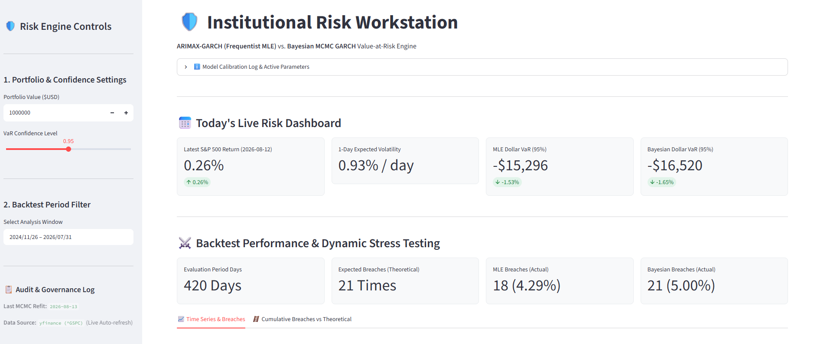

*Figure 5.1: The primary dashboard interface displaying live S&P 500 returns, expected conditional volatility, real-time MLE and Bayesian Dollar VaR figures, and interactive backtesting panels.*

#### **Key Functional Modules:**
1. **Live Executive Metrics:** Instantly calculates daily conditional standard deviation ($\sigma_t$) and outputs side-by-side Dollar VaR comparisons for both models.
2. **Interactive Backtest Viewer:** Features Plotly time-series plots enabling risk managers to isolate custom temporal windows and examine precise VaR breach locations.
3. **Cumulative Breach Audit:** Renders real-time step functions comparing observed empirical breaches against theoretical confidence thresholds.

### 5.3 Real-Time Market Shock Simulator ("What-If" Analysis)

  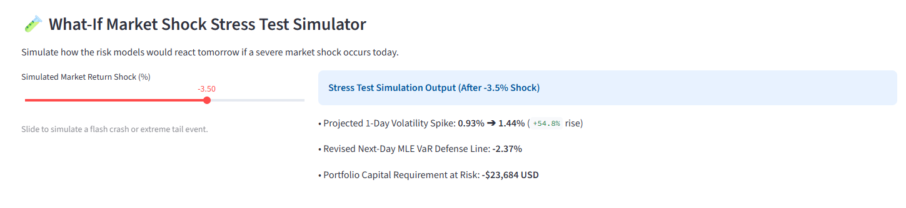

*Figure 5.2: What-If Stress Testing Simulator modelling conditional volatility spikes and capital-at-risk following a hypothetical return shock.*

The workstation includes a real-time shock simulator powered by the estimated GARCH(1,1) variance update equation:

$$\sigma_{t+1}^2 = \omega + \alpha_1 \, r_{\text{shock}}^2 + \beta_1 \, \sigma_t^2$$

#### **Stress Test Capabilities:**
* **Flash Crash Simulation:** Portfolio managers can apply hypothetical return shocks (e.g., $-3.5\%$ to $-10.0\%$) to simulate sudden market shocks.
* **Capital Reserve Adjustments:** Automatically forecasts the resulting volatility expansion ($\sigma_{t+1}$) and recalculates necessary capital reserve requirements ($USD$) for the subsequent trading session.

---

## 6. Conclusion & Future Directions

### 6.1 Summary of Findings

This project evaluated a dual-engine framework for forecasting Value-at-Risk (VaR) on the S&P 500, contrasting a **Frequentist ARIMAX-GARCH(1,1)** model with a **Bayesian $\text{Student-}t$ GARCH(1,1)** engine implemented in PyMC.

1. **Empirical Stylized Facts:** Exploratory analysis confirmed strong volatility clustering and excess kurtosis ($6.29$), validating the necessity of a $\text{Student-}t$ conditional distribution over standard Gaussian assumptions.
2. **Exogenous Sentiment Signal:** Incorporating Lag-1 VIX changes ($\Delta \text{VIX}_{t-1}$) into the conditional mean equation provided statistically significant predictive power ($p = 0.004$) while preserving out-of-sample integrity.
3. **Frequentist vs. Bayesian Performance:**
   * **Frequentist MLE:** Produced a highly persistent volatility model ($\alpha_1 + \beta_1 = 0.9797$) that delivered conservative risk boundaries ($18$ breaches out-of-sample vs. $21$ expected at $95\%$ confidence).
   * **Bayesian MCMC:** By integrating posterior parameter uncertainty and identifying a heavier tail distribution ($\nu \approx 5.88$), MCMC sampling achieved near-perfect empirical calibration ($21$ observed breaches vs. $21$ expected).
4. **Interactive Deployment:** The framework was deployed as an institutional-grade Streamlit workstation, enabling real-time Dollar VaR tracking and dynamic market shock stress testing.

### 6.2 Model Comparison Summary

| Metric / Dimension | Frequentist (MLE ARIMAX-GARCH) | Bayesian (MCMC PyMC GARCH) |
| :--- | :--- | :--- |
| **Conditional Tail Thickness ($\nu$)** | Light-to-Moderate ($\nu = 10.53$) | Heavy ($\nu = 5.88$) |
| **Parameter Uncertainty** | Ignored (Point Estimate) | Explicit (Posterior HDI) |
| **95% VaR Breaches (Out-of-Sample)** | $18$ Breaches *(Slightly Conservative)* | $21$ Breaches *(Near-Perfect Calibration)* |
| **Computational Speed** | Fast ($< 0.2\text{s}$) | Intensive (Offline Sampling Required) |
| **Best Used For** | Real-time intra-day fitting | Portfolio tail-risk & MCMC governance |

### 6.3 Future Extensions

* **Asymmetric Volatility Models:** Extend the variance equation to EGARCH or GJR-GARCH to account for leverage effects (the tendency for negative shocks to increase volatility more than positive shocks of equal magnitude).
* **Multi-Asset Multivariate GARCH:** Expand the engine from univariate index modelling to a Bayesian Copula or DCC-GARCH framework to model time-varying cross-asset covariance across multi-asset portfolios.